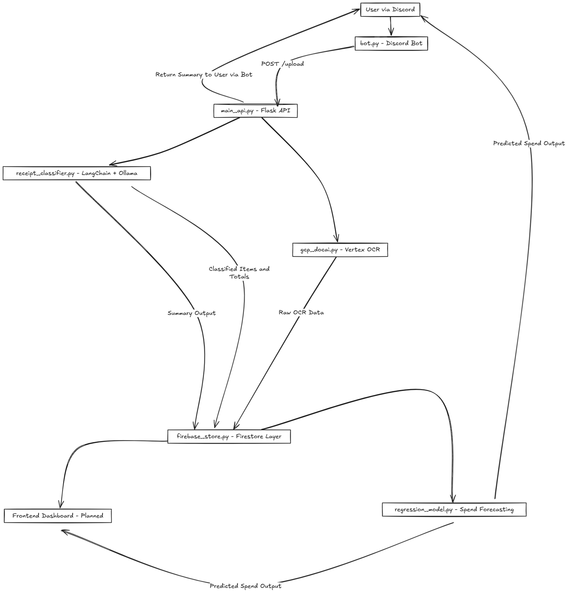

# Spendify

AI-driven system for processing receipt images, classifying line items and tracking personal spending.

---

## 🏗️ Architecture

```
Discord Bot → Flask API → Google Document AI → ADK Classification Pipeline → Firebase
```

1. **Discord Bot** – receives receipt images from users and forwards them to the API.
2. **Flask API** – orchestrates OCR, classification and data storage, also serving a simple dashboard.
3. **ADK Pipeline** – multi-agent system that groups and validates receipt items.
4. **Firebase** – persists raw OCR data and summarised spending information.



---

## 📁 Repository Structure

| Folder        | Description                                      |
| ------------- | ------------------------------------------------ |
| `discord_bot` | Bot for collecting images from Discord users.    |
| `flask_api`   | Flask service performing OCR and classification. |
| `adk_pipeline`| Agent Development Kit pipeline for receipts.     |

---

## 🚀 Quick Start

1. Install Python requirements in each module.
2. Configure `.env` files using the provided templates.
3. Start the Flask API:
   ```bash
   cd flask_api
   python main_api.py
   ```
4. In another terminal, run the Discord bot:
   ```bash
   cd discord_bot
   python bot.py
   ```
5. Access the dashboard at `http://localhost:8080/` (or your configured port).

---

## 🔧 Extending Spendify

* Modify the ADK agents under `adk_pipeline/receipt_classifier` to tweak classification behaviour.
* Adjust `firebase_store.py` if you prefer another database backend.
* Adapt `discord_bot/bot.py` for different chat platforms.

