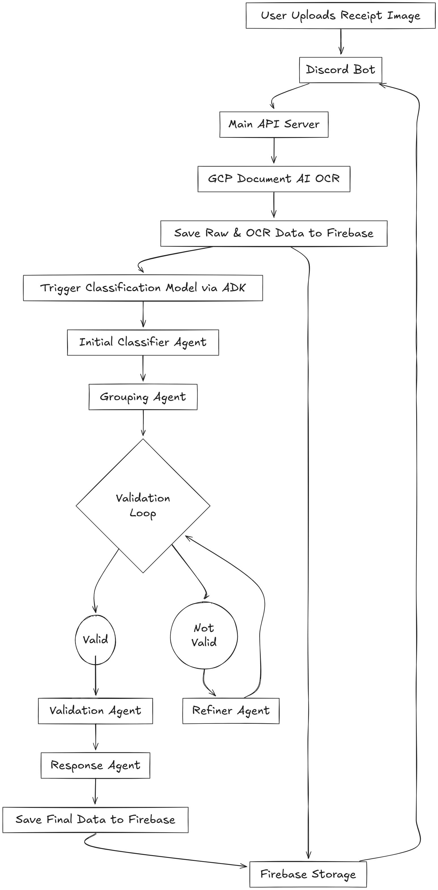

# Spendify

AI-driven system for processing receipt images, classifying line items and tracking personal spending.

> Spendify is a comprehensive receipt processing and classification system that combines Discord bot integration, Google Cloud AI services, and multi-agent AI pipelines to automatically categorize and analyze receipt data.

---

## 🏗️ Architecture

```
Discord Bot → Flask API → Google Document AI → ADK Classification Pipeline → Firebase
```



1. **Discord Bot** – receives receipt images from users and forwards them to the API.
2. **Flask API** – orchestrates OCR, classification and data storage, also serving a simple dashboard.
3. **ADK Pipeline** – multi-agent system that groups and validates receipt items.
4. **Firebase** – persists raw OCR data and summarised spending information.
   ```
   USERDATA/
   ├── {primary_id}/
   │   ├── sources/
   │   │   └── {source}: {identifier}
   │   └── metadata

   SESSIONS/
   ├── {session_id}/
   │   ├── timestamp
   │   ├── user_id
   │   └── source

   DATA/
   ├── RAW_DATA/
   │   └── {date}/
   │       └── {session_id}: raw_ocr_data
   ├── RECEIPTS/
   │   └── {date}/
   │       └── {session_id}: extracted_entities
   └── SUMMARIES/
      └── {date}/
         └── {session_id}: classified_data
   ```

---

## 📁 Repository Structure

| Folder        | Description                                      |
| ------------- | ------------------------------------------------ |
| `discord_bot` | Bot for collecting images from Discord users.    |
| `flask_api`   | Flask service performing OCR and classification. |
| `adk_pipeline`| Agent Development Kit pipeline for receipts.     |

### Project Structure
```
Spendify/
├── discord_bot/               # Discord bot module
│   ├── bot.py                # Main Discord bot
│   ├── requirements.txt      # Bot dependencies
│   ├── deploy-bot.md         # Bot deployment guide
│   └── .env.template         # Environment template
├── flask_api/                # Main API server module
|   ├── discord_bot/               # Discord bot module
│   |   └── index.html           # Frontend
│   ├── main_api.py           # Flask API server
│   ├── gcp_docai.py          # OCR processing
│   ├── firebase_store.py     # Data storage
│   ├── gcp_adk_classification.py # ADK client
│   ├── requirements.txt      # API dependencies
│   ├── deploy-api.md         # API deployment guide
│   ├── Dockerfile.api        # Docker configuration
│   ├── uploads/              # API file uploads
│   └── .env.template         # Environment template
├── adk_pipeline/             # Agent Development Kit pipeline
│   ├── receipt_classifier/   # Agent pipeline
│   │   ├── agent.py          # Root agent
│   │   ├── subagents/        # Individual agents
│   │   └── __init__.py       # Package initialization
│   ├── requirements.txt      # ADK dependencies
│   ├── deploy-adk.md         # ADK deployment guide
│   ├── flow.png              # Pipeline flow diagram
│   └── README.md             # ADK documentation
├── process.png               # System process diagram
└── README.md                 # Project documentation
```
---

## 🚀 Quick Start

1. Install Python requirements in each module & Configure `.env` files using the provided templates.
2. Start the ADK Server:
   ```bash
   cd adk_pipeline
   adk web
   ```
3. In another terminal, run the Flask API:
   ```bash
   cd flask_api
   python main_api.py
   ```
4. In another terminal, run the Discord bot:
   ```bash
   cd discord_bot
   python bot.py
   ```
5. Access the dashboard at `http://localhost:8080/` (or your configured port).

## System Components

### 1. Entry Points

#### Discord Bot (`bot.py`)
- Accepts image uploads from Discord users
- Handles user registration and authentication
- Manages file uploads and session tracking
- Provides real-time feedback to users

#### Main API (`main_api.py`)
- Central Flask API server
- Orchestrates the entire processing pipeline
- Handles user management and data flow
- Integrates all system components

### 2. Data Processing

#### GCP Document AI (`gcp_docai.py`)
- Extracts structured data from receipt images
- Identifies line items, totals, taxes, and merchant information
- Provides entity recognition and text extraction

#### Firebase Storage (`firebase_store.py`)
- Manages all data persistence operations
- Stores user data, sessions, raw OCR data, and classifications
- Provides structured data organization across collections

### 3. AI Classification Pipeline

#### ADK Client (`gcp_adk_classification.py`)
- HTTP client for Google Agent Development Kit
- Handles communication with multi-agent systems
- Manages session creation and event streaming

#### Receipt Classifier Agents (`adk_pipeline/receipt_classifier/`)
Multi-agent system with sequential processing:

1. **Initial Classifier**: Categorizes line items (Groceries, Fast Food, etc.)
2. **Grouping Agent**: Groups items by category with totals
3. **Validation Loop**: 
   - **Reviewer**: Validates classification accuracy
   - **Refiner**: Corrects misclassifications
4. **Response Agent**: Generates final summary and saves to Firebase

## Data Flow

1. User uploads receipt image via Discord
2. Bot saves image locally and calls API
3. API processes image through GCP Document AI
4. OCR extracts entities (items, totals, taxes)
5. Raw data stored in Firebase
6. Classification pipeline triggered via ADK
7. Multi-agent system processes receipt:
   - Classifies items by category
   - Groups and calculates totals
   - Validates against receipt total
   - Refines if validation fails
8. Final classified data saved to Firebase

---

## 🔧 Extending Spendify

* Update the List of Classification Options.
* Modify the ADK agents under `adk_pipeline/receipt_classifier` to tweak classification behaviour or enhance them.
* Adjust `firebase_store.py` if you prefer another database backend.
* Update the `discord_bot/bot.py` with more integrations.
* Adapt `discord_bot/bot.py` for different chat platforms.
* Update the Dashboad Options
* Add a Oauth2 Login using GMAIL to be done through API (including requested through bot).
* Create a Regression Model to Predict Individual User Spending.

---

## Contributing
1. Fork the repository
2. Create feature branch
3. Add tests for new functionality
4. Update documentation
5. Submit pull request