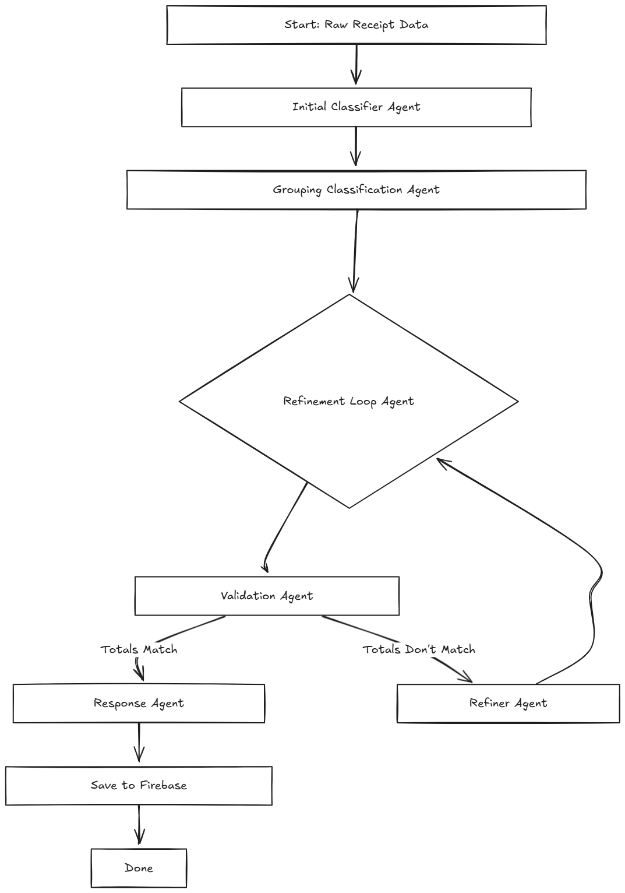

# Receipt Classification Pipeline

A robust, modular AI pipeline for automated receipt item classification, grouping, validation, and cloud storage—built with an extensible agent-based architecture.

---

## 🚦 Pipeline Overview

This project processes messy OCR receipt data in several intelligent steps:

1. **Classifies** line items into standard categories.
2. **Groups** items by category and computes category totals.
3. **Validates** that all totals match the original receipt.
4. **Refines** output if inconsistencies are found (up to 2 attempts).
5. **Saves** the final, validated classification to Firebase.

---

## 🗺️ Pipeline Flowchart



---

## 🧩 Agents Documentation

| Agent Name                        | File Location                      | Purpose / Description                                                                                                                                                                                                                              |
| --------------------------------- | ---------------------------------- | -------------------------------------------------------------------------------------------------------------------------------------------------------------------------------------------------------------------------------------------------- |
| **Initial Classifier Agent**      | `classifier_init/agent.py`         | Transforms raw receipt line items into structured objects, extracting item name, quantity (fills missing as "1"), price (fills/distributes as needed), and assigns a category (Groceries, Fast Food, Electronics, Apparel, Personal Care, Others). |
| **Grouping Classification Agent** | `classification_grouper/agent.py`  | Groups the structured items by assigned category and computes category-wise total prices.                                                                                                                                                          |
| **Validation Agent**              | `classification_reviewer/agent.py` | Checks if the sum of all category totals matches the receipt total. Allows for a small tolerance (±0.01). Provides feedback if validation fails.                                                                                                   |
| **Refiner Agent**                 | `classification_refiner/agent.py`  | If validation fails, moves items or adjusts prices to ensure category totals match the receipt total. Never creates new or fake items.                                                                                                             |
| **Response Agent**                | `classification_response/agent.py` | Generates a summary, attaches notes/warnings/timestamps, and saves the validated data to Firebase.                                                                                                                                                 |

---

## 💡 Key Features

* **Iterative Self-Correction:** Automatically refines classification until data integrity is achieved.
* **Data Integrity:** No hallucinated items; only corrects and groups original data.
* **Extensible:** Easily add categories, validation steps, or change output storage.
* **Cloud Persistence:** All results saved to Firebase for downstream analytics.

---

## 🏗️ Example Input

```json
{
  "line_items": [
    "2 Apple 10",
    "Mozzarella&Tomato 9.95",
    "1 Fren Onion Soup 5.95"
  ],
  "receipt_total_value": {
    "total_amount": "25.90",
    "net_amount": "23.60",
    "total_tax_amount": "2.30"
  },
  "grouped": {
    // Raw OCR or parsed data as a dictionary
  }
}
```

---

## 🚀 Getting Started

1. **Configure Firebase and Google Vertex AI credentials**

   * After Installing the Required Libraries Update your config files with Firebase and Vertex AI settings.

2. **Run the FastAPI server via ADK:**

   ```sh
   adk web
   ```

   This will launch the FastAPI server exposing your agent pipeline as a web API.

---

## 🛠️ Extending the Pipeline

* **Add categories:** Update category lists and schemas in `classifier_init/agent.py` and `classification_grouper/agent.py`.
* **Add extra validation:** Modify `classification_reviewer/agent.py` to enforce new business rules.
* **Change cloud backend:** Update `classification_response/agent.py` to swap out Firebase for your preferred storage.